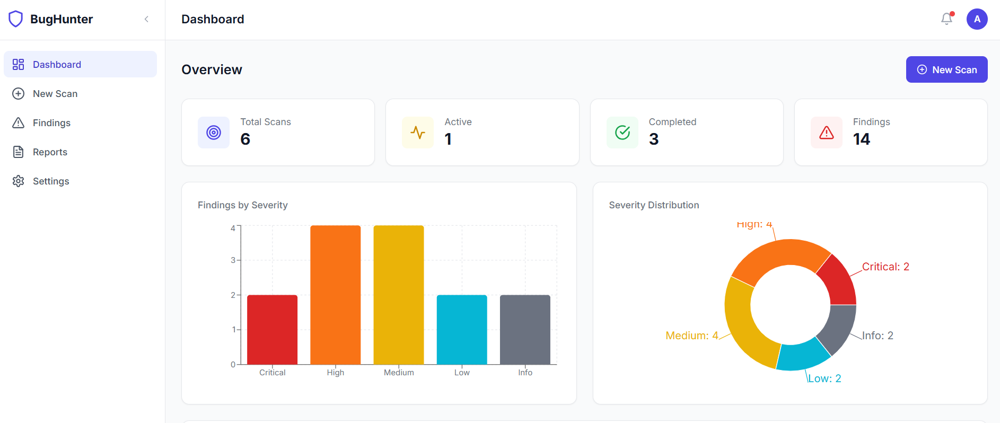
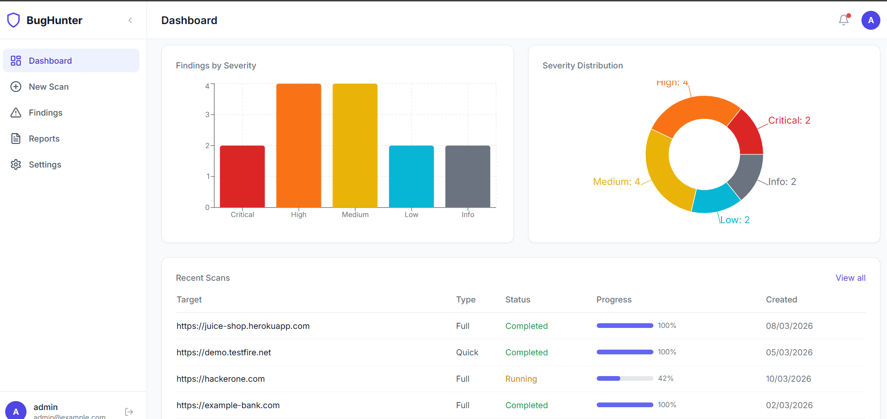
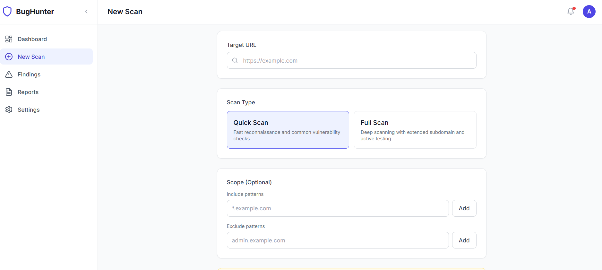
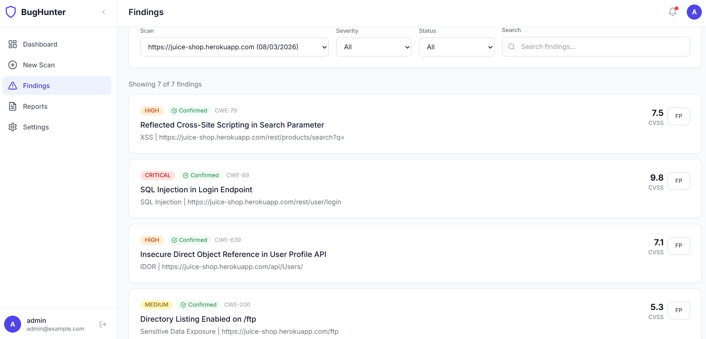
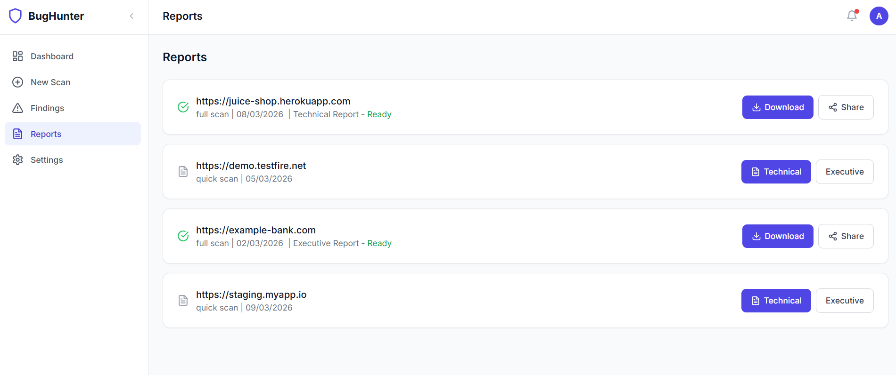
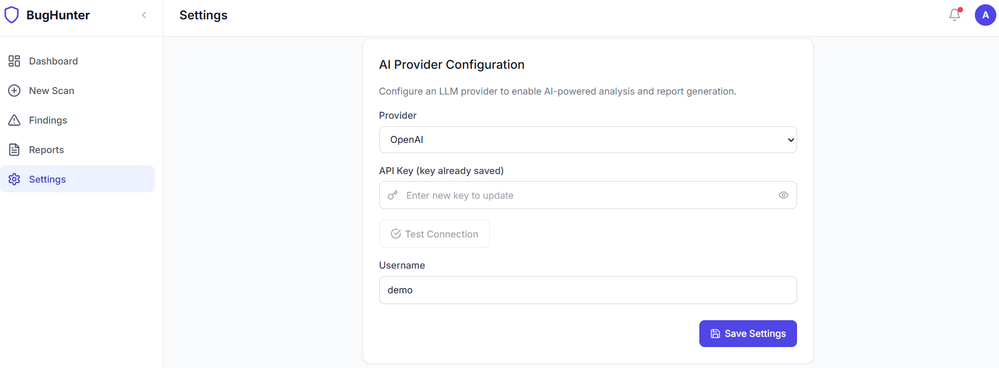

# BugHunter - Automated Bug Bounty Platform

BugHunter is a full-stack automated vulnerability scanning platform that combines multi-agent AI pipelines with a modern web interface to discover, analyze, and report security vulnerabilities in web applications.

Built with **FastAPI** + **Next.js 14** + **AI-powered analysis** (Claude / OpenAI).

---

## Screenshots

### Dashboard
Overview with scan stats, severity distribution charts (bar + donut), and recent scans table.





### New Scan
Configure target URL, scan type (Quick/Full), include/exclude scope patterns, and authorization consent.



### Findings
Browse discovered vulnerabilities with severity badges, CVSS scores, CWE identifiers, confirmed status, and false-positive toggle. Filter by scan, severity, status, or search.



### Reports
Generate, download, and share PDF reports (Technical or Executive). Track report generation status.



### Settings
Configure AI provider (Claude/OpenAI), test API key connections, update username, and change password.



---

## Architecture

```
┌─────────────────┐     ┌──────────────────────────────────────────────┐
│   Next.js 14    │────▶│              FastAPI Backend                 │
│   Frontend      │◀────│                                              │
│   (React 18)    │     │  ┌─────────┐  ┌──────────┐  ┌───────────┐  │
└─────────────────┘     │  │  Auth    │  │  Scans   │  │ Settings  │  │
                        │  │  (JWT)   │  │  CRUD    │  │ API       │  │
                        │  └─────────┘  └────┬─────┘  └───────────┘  │
                        │                    │                         │
                        │           ┌────────▼────────┐               │
                        │           │ Scan Orchestrator│               │
                        │           └────────┬────────┘               │
                        │                    │                         │
                        │  ┌─────┐ ┌────────┤ ┌──────┐ ┌────────┐   │
                        │  │Recon│→│Scanner │→│Exploit│→│Analyzer│   │
                        │  └─────┘ └────────┘ └──────┘ └───┬────┘   │
                        │                                   │         │
                        │                          ┌────────▼──────┐  │
                        │                          │   Reporter    │  │
                        │                          │  (PDF Gen)    │  │
                        │                          └───────────────┘  │
                        │                                              │
                        │  ┌──────────┐  ┌──────────┐                 │
                        │  │ SQLite / │  │ Redis    │  (optional)     │
                        │  │ Postgres │  │ + Celery │                 │
                        │  └──────────┘  └──────────┘                 │
                        └──────────────────────────────────────────────┘
```

### Agent Pipeline

The scanning engine operates as a 5-stage sequential pipeline:

| Stage | Agent | Purpose |
|-------|-------|---------|
| 1 | **ReconAgent** | DNS enumeration, port scanning, subdomain discovery, technology fingerprinting, URL crawling |
| 2 | **ScannerAgent** | Automated vulnerability testing (XSS, SQLi, CSRF, SSRF, IDOR, misconfigurations) |
| 3 | **ExploitAgent** | Proof-of-concept verification to confirm exploitability of detected vulnerabilities |
| 4 | **AnalyzerAgent** | AI-powered analysis: CVSS scoring, CWE mapping, severity classification, fix recommendations |
| 5 | **ReporterAgent** | PDF report generation with executive summary, detailed findings, and remediation guidance |

---

## Tech Stack

### Backend
| Component | Technology |
|-----------|-----------|
| Framework | FastAPI (Python 3.11+) |
| ORM | SQLAlchemy 2.0 (async) |
| Database | SQLite (dev) / PostgreSQL 15 (prod) |
| Task Queue | Celery + Redis (optional - inline fallback available) |
| Auth | JWT (access + refresh tokens), bcrypt, AES-encrypted API keys |
| PDF Gen | ReportLab |
| AI | Multi-provider LLM (Claude / OpenAI) with heuristic fallback |

### Frontend
| Component | Technology |
|-----------|-----------|
| Framework | Next.js 14 (App Router) |
| UI | React 18 + TypeScript |
| Styling | Tailwind CSS |
| Charts | Recharts |
| Icons | Lucide React |
| HTTP | Axios (with token interceptor & auto-refresh) |
| Mock Mode | Built-in mock API for offline development |

---

## Project Structure

```
bug_bounty_hunter/
├── backend/
│   ├── app/
│   │   ├── agents/                # AI scanning agents
│   │   │   ├── recon_agent.py     # Stage 1: Reconnaissance
│   │   │   ├── scanner_agent.py   # Stage 2: Vulnerability scanning
│   │   │   ├── exploit_agent.py   # Stage 3: Exploit verification
│   │   │   ├── analyzer_agent.py  # Stage 4: AI analysis
│   │   │   ├── reporter_agent.py  # Stage 5: Report generation
│   │   │   └── orchestrator.py    # Pipeline coordinator
│   │   ├── api/v1/               # REST API endpoints
│   │   │   ├── auth.py           # Register, login, refresh
│   │   │   ├── scans.py          # Scan CRUD + actions
│   │   │   ├── findings.py       # Findings + summary
│   │   │   ├── reports.py        # Report generation/download
│   │   │   ├── settings.py       # User settings + LLM config
│   │   │   └── agents.py         # Agent status + logs
│   │   ├── core/                 # Config, DB, security, types
│   │   ├── models/               # SQLAlchemy models
│   │   ├── schemas/              # Pydantic request/response schemas
│   │   ├── workers/              # Celery tasks (with inline fallback)
│   │   └── main.py              # FastAPI app entry
│   ├── tests/                    # pytest test suite
│   ├── alembic/                  # Database migrations
│   ├── requirements.txt
│   └── seed.py                   # Demo user seeder
├── frontend/
│   ├── app/                      # Next.js App Router pages
│   │   ├── (auth)/               # Login & Register
│   │   ├── dashboard/            # Dashboard with charts
│   │   ├── scans/new/            # New scan form
│   │   ├── scans/[scan_id]/      # Scan detail + WebSocket
│   │   ├── findings/             # Findings browser
│   │   ├── reports/              # Report management
│   │   └── settings/             # Settings panel
│   ├── components/layout/        # Sidebar, Navbar, Layout
│   ├── lib/                      # API client, auth, mock system
│   │   ├── api.ts               # Axios + token interceptor
│   │   ├── auth.ts              # JWT token management
│   │   ├── mock-api.ts          # Mock API adapter
│   │   └── mock-data.ts         # Realistic sample data
│   └── types/                    # TypeScript interfaces
├── Screenshorts/                 # Application screenshots
├── docker-compose.yml            # Full-stack Docker setup
├── .env.example                  # Environment template
└── README.md
```

---

## API Endpoints

### Authentication
| Method | Endpoint | Description |
|--------|----------|-------------|
| POST | `/api/v1/auth/register` | Register new account |
| POST | `/api/v1/auth/login` | Login (returns JWT tokens) |
| POST | `/api/v1/auth/refresh` | Refresh access token |

### Scans
| Method | Endpoint | Description |
|--------|----------|-------------|
| GET | `/api/v1/scans` | List scans (with pagination & filters) |
| POST | `/api/v1/scans/` | Create and start a new scan |
| GET | `/api/v1/scans/{id}` | Get scan details |
| DELETE | `/api/v1/scans/{id}` | Cancel a scan |
| POST | `/api/v1/scans/{id}/pause` | Pause a running scan |
| POST | `/api/v1/scans/{id}/resume` | Resume a paused scan |
| WS | `/api/v1/scans/{id}/live` | WebSocket for real-time progress |

### Findings
| Method | Endpoint | Description |
|--------|----------|-------------|
| GET | `/api/v1/scans/{id}/findings/` | List findings (filterable) |
| GET | `/api/v1/scans/{id}/findings/summary` | Severity summary |
| PATCH | `/api/v1/scans/{id}/findings/{fid}` | Update finding (false positive) |

### Reports
| Method | Endpoint | Description |
|--------|----------|-------------|
| POST | `/api/v1/scans/{id}/report/` | Generate report |
| GET | `/api/v1/scans/{id}/report/` | Get report status |
| GET | `/api/v1/scans/{id}/report/download` | Download PDF |
| POST | `/api/v1/scans/{id}/report/share` | Generate share link |

### Settings
| Method | Endpoint | Description |
|--------|----------|-------------|
| GET | `/api/v1/settings/` | Get user settings |
| PATCH | `/api/v1/settings/` | Update settings |
| POST | `/api/v1/settings/llm/test` | Test LLM connection |
| POST | `/api/v1/settings/password` | Change password |

### Agents
| Method | Endpoint | Description |
|--------|----------|-------------|
| GET | `/api/v1/scans/{id}/agents/` | List agents for scan |
| GET | `/api/v1/scans/{id}/agents/{name}/logs` | Get agent logs |

---

## Key Features

- **Multi-Agent Pipeline** - 5-stage scanning: Recon, Scanner, Exploit, Analyzer, Reporter
- **AI-Powered Analysis** - LLM-based vulnerability analysis with CVSS scoring & CWE mapping (heuristic fallback when no LLM configured)
- **Real-Time Progress** - WebSocket-based live scan updates
- **PDF Reports** - Professional vulnerability reports with executive summaries and detailed findings
- **Scope Control** - Include/exclude patterns for targeted scanning
- **False Positive Management** - Mark and filter false positives
- **Multi-Provider LLM** - Claude (Anthropic) and OpenAI support with connection testing
- **Offline Development** - Built-in mock data system for frontend development without backend
- **JWT Authentication** - Secure access/refresh token flow with auto-renewal
- **Zero Dependencies Mode** - Runs locally with SQLite and inline tasks (no Redis/PostgreSQL/Celery required)

---

## Running Tests

```bash
cd backend
source venv/bin/activate

# Run all tests
pytest

# Run with coverage
pytest --cov=app --cov-report=term-missing

# Run specific test files
pytest tests/test_models.py
pytest tests/test_security.py
pytest tests/test_analyzer_agent.py
pytest tests/test_reporter_agent.py
pytest tests/test_schemas.py
```

---

## Docker Deployment (Production)

```bash
# Build and start all services
docker-compose up --build -d

# Services:
#   - backend:  http://localhost:8000
#   - frontend: http://localhost:3000
#   - postgres: localhost:5432
#   - redis:    localhost:6379
```

---

## Environment Variables

| Variable | Default | Description |
|----------|---------|-------------|
| `SECRET_KEY` | - | Application secret key |
| `DATABASE_URL` | `sqlite+aiosqlite:///./bugbounty.db` | Async database URL |
| `DATABASE_URL_SYNC` | `sqlite:///./bugbounty.db` | Sync database URL (migrations) |
| `REDIS_URL` | _(empty)_ | Redis URL (optional) |
| `CELERY_BROKER_URL` | _(empty)_ | Celery broker (optional) |
| `JWT_SECRET_KEY` | - | JWT signing key |
| `AES_KEY` | - | AES encryption key for API keys |
| `NEXT_PUBLIC_API_URL` | `http://localhost:8000` | Backend API URL |
| `NEXT_PUBLIC_WS_URL` | `ws://localhost:8000` | WebSocket URL |
| `NEXT_PUBLIC_USE_MOCK` | `true` | Enable mock data mode |

---

## Demo Credentials

When running with `seed.py`:

| Field | Value |
|-------|-------|
| Email | `demo@bugbounty.com` |
| Password | `Demo1234!` |

---

## Licensing & Pricing

### Licensing Models

#### 1. Freemium / Open-Core (Recommended)

| Tier | Price | What's Included |
|------|-------|----------------|
| **Community (Free)** | $0 | Core scanner, 1 agent pipeline, SQLite, 3 scans/month, basic reports |
| **Pro** | $49/mo | All 5 agents, unlimited scans, PDF reports, AI analysis (BYOK), priority queue |
| **Team** | $149/mo | Multi-user, shared dashboard, role-based access, team findings board, Slack/webhook alerts |
| **Enterprise** | $499+/mo | On-premise deployment, SSO/SAML, custom agents, SLA, dedicated support, compliance reports |

#### 2. Per-Scan Pricing (Usage-Based)

| Plan | Price |
|------|-------|
| Pay-as-you-go | $5 per quick scan, $15 per full scan |
| Credit packs | 50 scans for $150 (30% discount) |
| Unlimited | $299/mo flat rate |

#### 3. One-Time License (Self-Hosted)

| License | Price | Target |
|---------|-------|--------|
| Single Developer | $299 | Freelance pentesters |
| Small Team (up to 5) | $799 | Small security teams |
| Organization (unlimited) | $2,499 | Companies, agencies |
| White-Label / OEM | $5,000+ | Resellers who rebrand it as their own product |

### Why BugHunter

- **AI-powered analysis** (Claude / OpenAI) — a key differentiator over traditional scanners
- **Full pipeline automation** — not just scanning, but exploit verification + report generation
- **Professional PDF reports** — hand directly to stakeholders
- **Multi-provider LLM** — not locked to one vendor
- **Zero-dependency local mode** — easy setup, no infrastructure headache
- **Clean modern UI** — production-ready from day one

### Revenue Channels

| Channel | Description |
|---------|-------------|
| **SaaS (Hosted)** | Host the platform, charge monthly subscriptions. Users sign up and scan from the browser. |
| **Downloadable License** | Sell as self-hosted software with a license key. No server costs for you. |
| **API-as-a-Service** | Expose the scanning pipeline as a REST API for CI/CD integration. Charge per API call. |
| **White-Label** | Let security agencies rebrand it as their own tool. $5,000–$15,000 per license. |
| **Marketplaces** | Sell on Gumroad, LemonSqueezy, AWS Marketplace, or Codecanyon. |

### Market Comparison

| Tool | Pricing | BugHunter Advantage |
|------|---------|-------------------|
| Burp Suite Pro | $449/year | AI-powered analysis, automated pipeline |
| Acunetix | $4,500/year | 10x cheaper, same core scanning |
| Invicti (Netsparker) | $6,000+/year | Self-hosted option, LLM integration |
| Detectify | $275/mo | Full pipeline with exploit verification |
| Intruder | $113/mo | Competitive pricing with more features |

**Sweet spot: $49–149/mo subscription or $299–799 one-time license** — undercutting enterprise tools while offering AI-powered analysis they don't have.

---

## Roadmap

Features planned for upcoming releases:

| Feature | Description | Priority |
|---------|-------------|----------|
| License key system | Enforce paid tiers, prevent unauthorized use | High |
| Usage limits | Free tier: 3 scans/mo, Pro: unlimited | High |
| Multi-tenancy | Multiple users with isolated data & roles | High |
| CI/CD integration | GitHub Actions / GitLab CI plugin | Medium |
| Scheduled scans | Recurring weekly/monthly automated scans | Medium |
| Email notifications | Scan complete / new critical finding alerts | Medium |
| Compliance templates | OWASP Top 10, PCI-DSS, SOC2 report formats | Medium |
| Landing page | Marketing website with pricing, demo, and docs | Medium |

---

## License

This project is for authorized security testing purposes only. Always ensure you have explicit permission before scanning any target.

For commercial licensing inquiries, please contact the maintainers.
